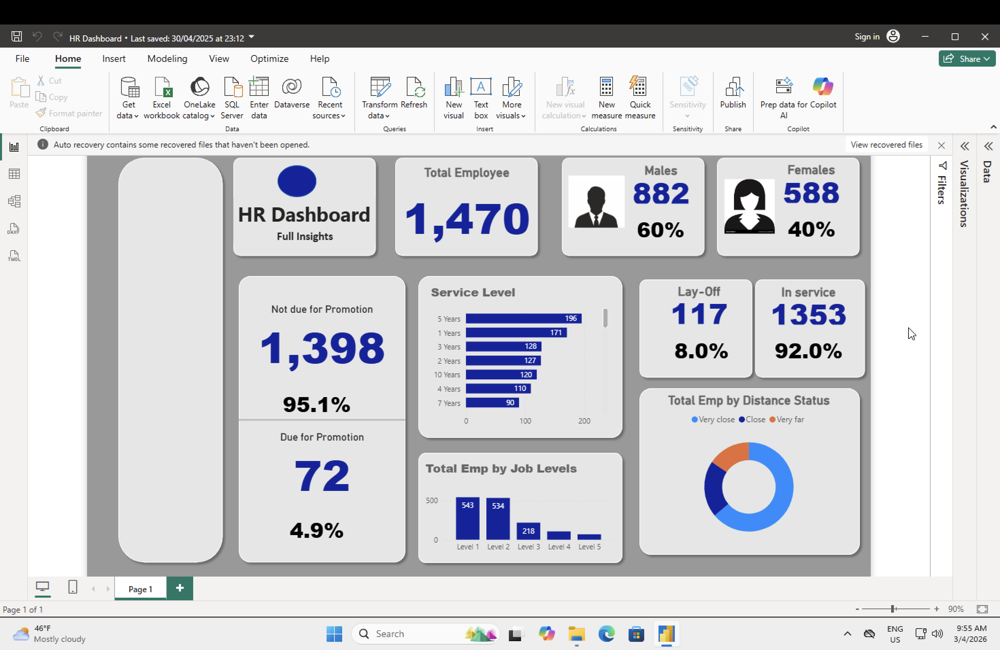

# 📊 HR Analytics Dashboard — Power BI

An interactive HR Analytics Dashboard built in Microsoft Power BI to help 
HR teams make data-driven decisions about workforce promotion, retrenchment, 
gender distribution, and employee satisfaction.

---

## 📌 Project Overview

| | |
|---|---|
| **Tool** | Microsoft Power BI Desktop |
| **Data Source** | Kaggle — IBM HR Analytics Dataset |
| **Employees** | 1,470 records |
| **Dashboard Pages** | Home · Action · List |

---

## 📈 Key Insights from the Dashboard

- **1,470 total employees** — majority male
- **4.9% (72 employees)** are due for promotion (not promoted in 10+ years)
- **Retrenchment analysis** — identifies employees at risk of lay-off
- **Service level** — majority of employees have 5 years of service or are in year 1
- **Job satisfaction** — 84.6% high performance rating; significant low satisfaction group identified
- **Distance from office** — most employees live close; 15.58% may face commute difficulty
- **Department breakdown** — Research & Development has highest promotions and lay-offs

---

## 🗂️ Dashboard Pages

### Home Page
Quick summary KPIs — Total Employees, Gender split (Male/Female), 
Promotion eligibility, Retrenchment status, Service Level bar chart, 
Distance from office donut chart

### Action Page
Promotion and retrenchment breakdown by department and job role, 
overtime analysis, performance rating cards

### List Page
Detailed table view of all employees with promotion and lay-off status

---

## 🛠️ Tools & Skills Used

- **Microsoft Power BI Desktop** — dashboard design and publishing
- **Power Query** — data cleaning, transformation, conditional columns
- **DAX (Data Analysis Expressions)** — 18+ calculated measures including:
  - `Total Employees = COUNTROWS('HR Analytics Data')`
  - `Due for Promotion` — employees not promoted in 10+ years
  - `% Due for Promotion = DIVIDE([Due for Promotion], [Total Employees], 0)`
  - Retrenchment, In-Service, Gender ratio measures
- **Data Modelling** — relationship between tables via `EmployeeNumber` key
- **Interactive Visualizations** — Cards, Bar Charts, Column Charts, Donut Charts, Tables

---

## 📁 Data Files

| File | Description | Rows | Columns |
|---|---|---|---|
| `HR Analytics Data.csv` | Main HR dataset | 1,470 | 35 |
| `HR employee data.csv` | Employee lookup table | 1,470 | 2 |
| `data.csv Retrenchment.csv` | Retrenchment status | — | — |
| `data.csv promotion.csv` | Promotion status | — | — |

Both main tables share `EmployeeNumber` as the key — Power BI auto-detected 
and created the relationship in the data model.

---

## 📸 Dashboard Preview

---

## 📁 Files in This Repo

| File | Description |
|---|---|
| `HR_Dashboard.pbix` | ✅ Final completed dashboard |
| `HR_Dashboard_practice_File.pbix` | 📝 Practice/starter file |
| `data/` | All 4 source CSV files |
| `screenshots/` | Dashboard preview images |

---

*Built by Kumari Shivani *
